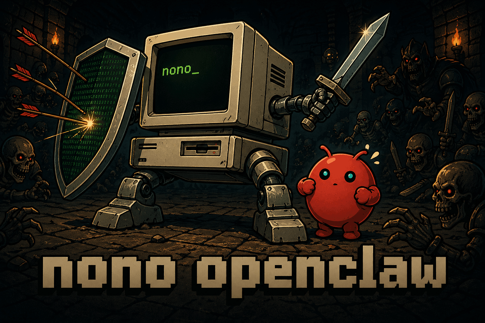

# openclaw-pack



nono pack for [OpenClaw](https://openclaw.ai) AI agents!

## Packs

| Pack | Description |
|---|---|
| [`openclaw`](./openclaw/) | Sandbox policy and multi-agent coordination for OpenClaw |

## Installation

```bash
nono pull always-further/openclaw
```

## Usage

Run a sandboxed OpenClaw session:

```bash
nono run --profile openclaw -- openclaw
```

Run multiple sandboxed instances in parallel:

```bash
nono run --profile openclaw -- openclaw
nono run --profile openclaw --home ~/.openclaw-agent1 -- openclaw
nono run --profile openclaw --home ~/.openclaw-agent2 -- openclaw
```

## What's in a pack

Each pack is a directory containing:

- `package.json` — pack metadata (name, version requirements, artifacts)
- `policy.json` — nono sandbox profile (filesystem, network, IPC capabilities)
- `skills/` — instruction files that teach the agent its constraints
- `bin/` — hook scripts that fire on sandbox events

See the [nono registry](https://registry.nono.sh) to browse and pull packs.

## Publishing

Packs are published to the nono registry via GitHub Actions on tag push. To release a new version:

```bash
git tag openclaw-v0.2.0
git push origin openclaw-v0.2.0
```

The workflow at `.github/workflows/publish.yml` handles signing and publishing automatically.
